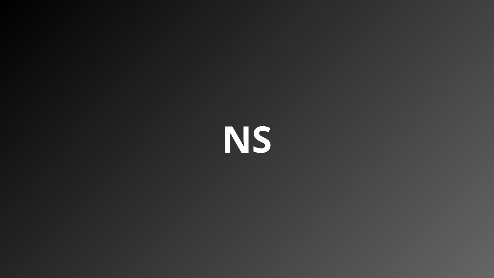

<br/>

# Personal Portfolio | Nicholas Serencovich
> **Full Stack Developer** specializing in robust Backend systems and high-end Frontend interfaces.

## 📖 The Project
This portfolio serves as a bridge between my background in **Systems Development** and my expertise in modern UI. While this specific repository focuses on a premium Frontend experience, it was architected with a "Backend-first" mindset regarding data flow, performance, and scalability.

## Project Tech Stack (Frontend focus)
   

## ⚙️ Core Full Stack Skills

| Type | Technologies |
|-|-|
| **Backend** | Java, Spring Boot, Clean Architecture, SOLID, REST APIs |
| **Frontend** | Next.js, Redux.js, TypeScript, TailwindCSS  |
| **DevOps** | Docker, Git, PNPM, Github Actions |

## Why this matters?
Even as a Frontend project, this site highlights my ability to:
1. **Understand Architectural Logic:** Using a Java-mock object in the Hero section to represent my identity.
2. **Handle Complex Data:** Implementing a multi-language (i18n) dictionary system.
3. **Write Maintainable Code:** Applying clean code principles that I use daily in my Java projects.

## 🏗️ Architectural Mindset
Although this is a static-side generated (SSG) project, it follows a **Domain-Driven Design (DDD)** inspired structure:
| Folder | Description |
|-|-|
| **Components** | Atomic UI units following the Single Responsibility Principle. |
| **Shared** | Global constants, variants, and types to ensure a single source of truth |
| **Dictionaries** | Decoupled content from logic, allowing easy scaling to other languages. |

## Key Features
- **Internationalization (i18n):** Full support for English and Portuguese with persistent locale detection.
- **Optimized Performance:** 100/100 Lighthouse scores in Best Practices and SEO.
- **Dynamic Animations:** Orchestrated entry animations using Framer Motion variants.
- **Type Safety:** 100% TypeScript coverage for better maintainability and fewer runtime errors.

```bash
# In case you want to run on your computer, follow the steps:

## 1. Clone the repository:

git clone https://github.com/nicholas-sc-08/nicholas-serencovich-portfolio.git

# 2. Install dependencies using PNPM:

pnpm install

# 3. Run the development server:

pnpm run dev
```

## 📜 License & Copyright

[](https://creativecommons.org/licenses/by-nc-nd/4.0/)

This project is licensed under the **Creative Commons Attribution-NonCommercial-NoDerivs 4.0 International (CC BY-NC-ND 4.0)**.

- **Non-Commercial**: You may not use this code for commercial purposes.
- **No-Derivatives**: You may not distribute modified versions of this design/code.
- **Attribution**: You must give appropriate credit if you share this work.

© 2026 Nicholas Serencovich. All rights reserved.

## Let's Connect!
If you're interested in my work or want to discuss software architecture and full-stack development, feel free to reach out!

- **LinkedIn**: https://www.linkedin.com/in/nicholas-s-carvalho/
- **Email**: nicholassc.2008@gmail.com
- **GitHub**: [@nicholas-sc-08](https://github.com/nicholas-sc-08)# Personal Portfolio | Nicholas Serencovich
> **Full Stack Developer** specializing in robust Backend systems and high-end Frontend interfaces.

## 📖 The Project
This portfolio serves as a bridge between my background in **Systems Development** and my expertise in modern UI. While this specific repository focuses on a premium Frontend experience, it was architected with a "Backend-first" mindset regarding data flow, performance, and scalability.

## Project Tech Stack (Frontend focus)
    

## ⚙️ Core Full Stack Skills

| Type | Technologies |
|-|-|
| **Backend** | Java, Spring Boot, Clean Architecture, SOLID, REST APIs |
| **Frontend** | Next.js, Redux.js, TypeScript, TailwindCSS  |
| **DevOps** | Docker, Git, PNPM, Github Actions |

## Why this matters?
Even as a Frontend project, this site highlights my ability to:
1. **Understand Architectural Logic:** Using a Java-mock object in the Hero section to represent my identity.
2. **Handle Complex Data:** Implementing a multi-language (i18n) dictionary system.
3. **Write Maintainable Code:** Applying clean code principles that I use daily in my Java projects.

## 🏗️ Architectural Mindset
Although this is a static-side generated (SSG) project, it follows a **Domain-Driven Design (DDD)** inspired structure:
| Folder | Description |
|-|-|
| **Components** | Atomic UI units following the Single Responsibility Principle. |
| **Shared** | Global constants, variants, and types to ensure a single source of truth |
| **Dictionaries** | Decoupled content from logic, allowing easy scaling to other languages. |

## Key Features
- **Internationalization (i18n):** Full support for English and Portuguese with persistent locale detection.
- **Optimized Performance:** 100/100 Lighthouse scores in Best Practices and SEO.
- **Dynamic Animations:** Orchestrated entry animations using Framer Motion variants.
- **Type Safety:** 100% TypeScript coverage for better maintainability and fewer runtime errors.

```bash
# In case you want to run on your computer, follow the steps:

## 1. Clone the repository:

git clone https://github.com/nicholas-sc-08/nicholas-serencovich-portfolio.git

# 2. Install dependencies using PNPM:

pnpm install

# 3. Run the development server:

pnpm run dev
```

## 📜 License & Copyright

[](https://creativecommons.org/licenses/by-nc-nd/4.0/)

This project is licensed under the **Creative Commons Attribution-NonCommercial-NoDerivs 4.0 International (CC BY-NC-ND 4.0)**.

- **Non-Commercial**: You may not use this code for commercial purposes.
- **No-Derivatives**: You may not distribute modified versions of this design/code.
- **Attribution**: You must give appropriate credit if you share this work.

© 2026 Nicholas Serencovich. All rights reserved.

## Let's Connect!
If you're interested in my work or want to discuss software architecture and full-stack development, feel free to reach out!

- **LinkedIn**: https://www.linkedin.com/in/nicholas-s-carvalho/
- **Email**: nicholassc.2008@gmail.com
- **GitHub**: [@nicholas-sc-08](https://github.com/nicholas-sc-08)

Note: For a deep dive into my Backend expertise (Java/Spring Boot), check out <a href="https://github.com/nicholas-sc-08/vortexpay-api" target="_blank">VortexPay</a>, a robust digital banking API.